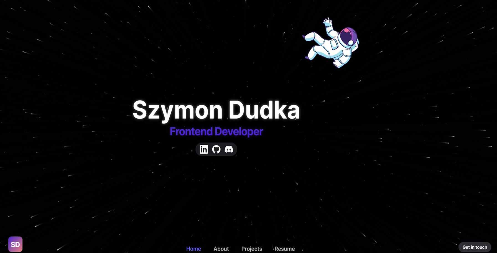

# Personal Portfolio



My own portfolio page. Responsive website without the use of any CSS framework.

https://szymondudka.xyz

https://personal-portfolio-sd.vercel.app

## Main technologies


![Sanity](https://img.shields.io/badge/Sanity-FFFFFF?style=for-the-badge&logo=data:image/png;base64,iVBORw0KGgoAAAANSUhEUgAAADAAAAAwCAYAAABXAvmHAAAACXBIWXMAAAsTAAALEwEAmpwYAAAGvUlEQVRo3u1aCVBVZRRmpmnV0kwlF1wQlUVQQRR3Kc0lGSvH1KbFdcbKamzUprFMx6UyTS2VStPUCEURVNxxBQl3cxsbx5oWssz37lt4273v8XXOufCAGUFZLsYM/8zPPN6993G+/2zfdx4Bln6d82jbaunOC6AfqM07oBBJbQVgqwNQB6AOQHUB6N8Flr5RULp3hNK5FZSIFjCHN9N3RHMoUUFQuoXA0idSv/d/A2BAVzFKISPZWEt8DGyjBsM+YRTsU8chf+p42CeOhm30MFiH9ILSpQ3MHZtCiQvVn72nAOKjoXRtC3PYk7C9/Byci+fDnfI91P0ZUI8cgJp1SN9HMqEe2A1PegpcXy2D/Z1J4g1zaKB4rQoeqSQA/oO0FTKAQ8a5aC7UnGPQTh6HmkmG7kqDZ0cq7a3FO2Mb1H07oR0/SvflwJ20DraXEmBu3xhKbAfyRnQNAiDXmzs0gXVwHNypP0A7c4IMJKPTNsOzfUv5m7zAW8s+Ai03C45Z0yg/Wun5UfGQqgQAChsxfkQ81ONkRPbh0oazgbu3Qz12EFrOUTlxCaO9O/RrRffxM3u2w3v+DJxLP4YS2RKWuLCKhlMlAPSgKhMdDO/PV6BdPA8PxbzfIAoT7cdjZNgOuFYugWPBLNnOLxbBszOVrmURuPRiwAyI3z93CvnTJlM4NTEYAH24qcXDcHw0A7w4Wd3J68UQlYxWsw7DsfBDvdpQcnMpVTq1kMpjGRgLx+zp4hl1X0YpEOqhfZInnAcSSoYBoHJpav2oVBhe2oWzcK1N1E+Rwil/5lS6/hgZTeHQp5P+DFcZLrPUG0yt6lNpHQ+V4t+zK12ek03Ga6dykT/9dSqxgcYBUGLbS/32/fm7AChQVX/ouFZ9LvWdQ+y2YcDv9QqHuW1DOJfMh/fSeaiH9/u399JPcK//RvdW704GAaCwsDzVDT6zCUWrgF6rRzNhHdQD5jYN6HpMuSEoIULhZJ/yit7sxhfuyWNhe/V5v8eMARDdTozw3fwHpZbPh/wZb8DU9D6Ymj2oAy2rQXHz695Bmp/kSOGW3zu39vcYY3KgZxjMlJTeKxdxu8XlMv/dKXKCZsoVU/OHpLIoMe0qcqrGllFT4ANwb1iN8pbv1k14qOs6ly4kijFCBxT8uA6obQPdQxU76eoDIIRtaG9UZPn+/ktKpevr5bC/+Zp0XA414ULcfWuUC1EMmwLvh+PTOajs8v17E+61q2Ad3lc+S4kMKj/5qxUAnxbnQstH4Fz+CTUDtdJA4PXClbhUyrM5pJFUuJohc+QF5i3cla1UEt1bklCV5buRBwuX4eCGFfVEFfSAJCGz0qYwBdWH7cWhcK1YLASvoESfuGsQeX9ACWtmMJUoS5FRzecurJfNxnKK9nEjReCwkCnq3HdazhWfyWfcO1HPXiEOJCot5AkJMaYOnDO2scMJ0Dxop3PLTomrl6FwlesZbiAA5inEaSy9Ikrs8LL5Cwt9lo+kIbjimNs1go2og3b5wm3K7Q26P1JvfIYAEAFPJ9ytvdCB4t1Rj10GUZ6q4msE9la9AFJzPeH79XopAAV2K6zPxOmErtoB8EmSkHHMngH35g0izrkx8XZvXCO6WIkJubOqYjlK+ZL/9kS/ACoGYBNgwomM8ACHAQPwXruqTx2IhcpmfXvuNOyTxlBFqlc2kSPj+XSZFPIhqJl74Pp2Jby//VIcQkwajQohpWswrMP6wMP6lrhOSR3Mxqj7d8E25lmd7zDLpNCSHKEkLsoDJneOee+LAOJn3UlrpVJJEl+/RmIoSPeiYVyI3O9c8AG0sydKi/ltm4TvsDhxzJkJ6wsDdS+wwOEkfzpWiB2HnigyCh/RxKnJMkvi5U7ZKBzJUE3MecDs0i/SS4JI2yQTCX6fPeJO/g6u1V/CvS5RDFWPHdKnGEWCXoAnQyMtzY1MtHQUeaBfF4PHKiQ+rAkDKJR2QjuRrQ+uSo5M+HVGmoSG5Ap7hoU861//fSkCnjs3e4RHj9IE42uCSjCFCG8unnAlLhNBLpOFwqHV3Qy3eKKhnT0J99YkOXkhc0XNsEY6MVeUKH0KLSWRJwu52Xr4HNwrYxaZPHCs89Rud7qMFiWMTubI7Mgx9z3KkVC9+1ZO4FSRSnBjoooh0wh6nf/WBJk4cGWRcKEQkzCi6sRTOA4Z15oVMk7kes9VSXpH5eai1cSFiga9hdNmmQlRH7Am9Idt1BDiQAlSWq0jB+lNiu/j8Xr1yEoDvqHhJhYXKtWKOyqrLflygxuY0I2Iuq+Y6gDUAagDUBpArf9nj1r97zb/AbgHA9gTqDakAAAAAElFTkSuQmCC)

## Stack

- [Sanity](https://www.sanity.io) - the platform for structured content that powers remarkable digital experiences
- [Framer Motion](https://www.framer.com/motion) - production-ready motion library for React
- [Figma](https://www.figma.com) - a collaborative web application for interface design
- [Next.js Progressbar (NProgress)](https://github.com/apal21/nextjs-progressbar) - a simple Next.js progressbar component using NProgress
- [TagCloud](https://github.com/cong-min/TagCloud) - 3D TagCloud that rolling with the mouse

## Details

- created with the React (Next.js) and TypeScript
- server-side rendering and better SEO
- CMS with Sanity.io
- animations created with Framer Motion
- HTML semantic tags
- responsive website design without using any CSS framework
- using CSS modules
- design created with Figma Software
- hero section inspired by one of Astro landing page template

## Tutorial and project structure

Inside of project, you'll see the following folders and files:

```
PROJECT_ROOT
├── pages               # page files
├── public              # static assets
├── sanity              # Sanity studio
└── src
    ├── assets          # images and files
    ├── components      # React components
    ├── lib             # config files
    ├── styles          # global and page styles
    └── types           # TypeScript types
```

Download the repository to your local machine and run to download all missing dependencies:

```
npm install
```

After that you can run this project using:

```
npm run dev
```

To build your application use:

```
npm run build
```

<!-- **If you want to deploy your application, you have to move `.htaccess` file to your build folder because this project provides only client-side routing.** -->

**To manage the content on the website you need to create a new sanity project. Use schemas from `sanity/schemas` folder. Check the official documentation: https://www.sanity.io/docs/getting-started**

After creating your own sanity project, create the `.env.local` file in the main folder and enter the following data:

```
NEXT_PUBLIC_SANITY_PROJECT_ID = YOUR_SANITY_PROJECT_ID
NEXT_PUBLIC_SANITY_PROJECT_DATASET = YOUR_SANITY_PROJECT_DATASET
```
